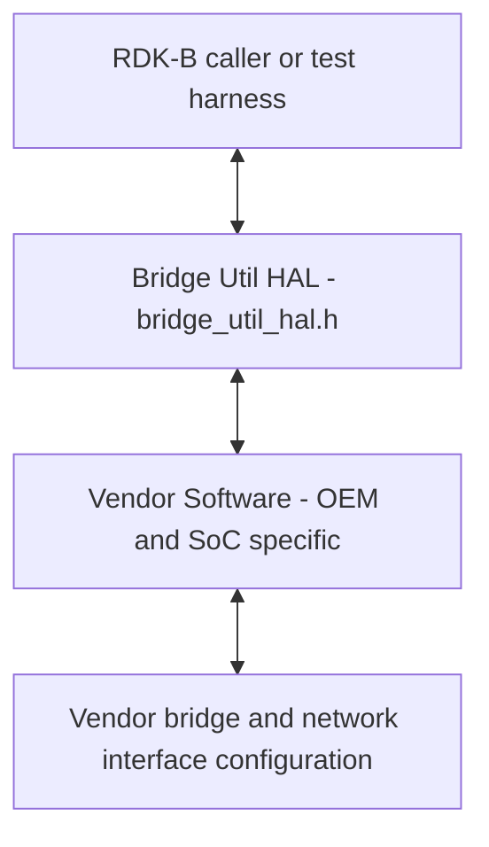
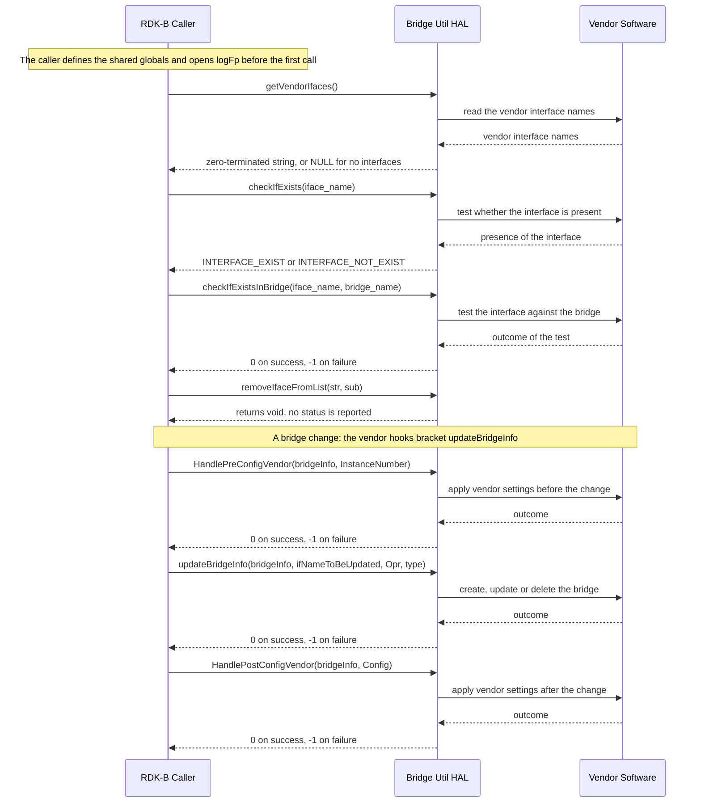

# Bridge Util HAL Documentation

## Version History

This table records revisions of *this document*. It is not the version of the interface, of the repository, or of the generated documentation site; those are three further identities, kept apart immediately below.

| Date | Comment | Version |
| --- | --- | --- |
| 2026-08-24 | Brought to the canonical `HAL` specification topic set. Every declared `API` is now named, the two misspelt identifiers in the sequence diagram are corrected, the four version identities are separated, and the interface's own return convention, public types and status values are documented. | 0.1.0 |

This document carried no `Version History` before this change, so the row above is the first one recorded rather than a claim that the document is new.

**Provenance: this page supersedes `docs/pages/BridgeUtilHalSpec.md`.** That file was this repository's `HAL` specification until the documentation work recorded in the row above replaced it, at which point the specification moved to the canonical filename [halSpec.md](halSpec.md) that every `RDK-B` `HAL` repository now uses. The predecessor is not lost \- it is readable at `git show 2b0bde2^:docs/pages/BridgeUtilHalSpec.md` \- but two things about the transition are worth stating plainly, because a reader tracing this document's lineage will otherwise be misled by the tooling.

- **The content was rewritten, not moved.** The replacement was authored against the two headers rather than edited down from the old page, so the two files share effectively no text. Every topic here is new or substantially reworked, and the old page's claims were checked against the declarations rather than carried forward \- which is how the two misspelt identifiers and the stale statements this revision corrects were found.
- **Git rename detection therefore does not link the two paths.** Because the similarity between them is effectively zero, `git` reports the change as one deletion and one addition rather than as a rename, and it does so even with detection forced to its one-per-cent floor (`git show --raw -M1% --find-renames=1% 2b0bde2 -- docs/pages/`). `git log --follow ./docs/pages/halSpec.md` consequently stops at the commit that introduced this file and does not continue into the predecessor's history. A reader who needs that history reads the old path directly with `git log -- docs/pages/BridgeUtilHalSpec.md`, which returns the predecessor's eleven commits back to the header's migration to GitHub. This paragraph exists because the tooling cannot state the relationship, so the document states it instead.

Four version identities exist around this interface, and a reader who conflates them will draw the wrong conclusion about how mature it is:

- **Document revision** \- the `Version` column above. This document is at `0.1.0`.
- **Release tag** \- `1.3.0` is the latest tag and the release this document describes. The repository's changelog records it **without a date**; its only entry is a merge of the preceding tag, so no release date is claimed here.
- **Interface version** \- **not exposed programmatically.** Neither `bridge_util_hal.h` nor `network_interface.h` declares a version macro, so a caller cannot test the interface version at compile time or at runtime, and the release tag above must not be read as one. See `Variability Management`.
- **Generated-site version string** \- `docs/generate_docs.sh` derives `PROJECT_VERSION` from `git describe --tags` and passes it verbatim to the documentation generator, so the title of the generated site carries a string of the form `<tag>-<commits-since-tag>-g<abbreviated-commit>`: the `1.3.0` tag, the number of commits made since it, and an abbreviated commit hash. **No literal value for it is recorded here, because it advances with every commit** \- any value written into this document would be wrong from the next commit onward, and a stale one invites a reader to mistake a build coordinate for a released version. It is a build identifier, not a released version of either the interface or this document. A reader comparing two generated sites compares the tag portion and treats the suffix as a build coordinate.

The repository's release lineage, taken from the repository's changelog, is below. It is the release identity, not the document identity.

| Release | Date recorded in the changelog | Notable change |
| --- | --- | --- |
| `1.0.0` | 2024-04-17 | Migration of the Bridge Util `HAL` header to GitHub. |
| `1.1.0` | 2024-05-24 | Header and specification updates. |
| `1.1.1` | 2024-05-24 | Removal of the `OVS` agent API header from `bridge_util_hal.h`. |
| `1.2.0` | 2024-07-10 | Work on removing the `OVS` dependency, including one revert and re-application. |
| `1.2.1` | 2025-07-31 | New enumerators for the mesh onboard bridges. |
| `1.2.2` | 2025-08-01 | DHCP Option 82 support for the connected building amenity network. |
| `1.3.0` | none recorded | Merge of the `1.2.2` tag into the development branch. |

## Acronyms

- `HAL` \- Hardware Abstraction Layer
- `RDK-B` \- Reference Design Kit for Broadband Devices
- `OEM` \- Original Equipment Manufacturer
- `OVS` \- Open vSwitch
- `API` \- Application Programming Interface
- `SoC` \- System on Chip
- `GRE` \- Generic Routing Encapsulation
- `VLAN` \- Virtual Local Area Network
- `MoCA` \- Multimedia over Coax Alliance
- `QoS` \- Quality of Service
- `MTU` \- Maximum Transmission Unit
- `UTC` \- Coordinated Universal Time

## Description

The Bridge Util `HAL` is an abstraction layer that lets `RDK-B` drive vendor bridge configuration without knowing how a particular platform implements it. Its own file-level description states the scope directly: it exists to interact with vendor software to control settings such as bridge modes, connection enable and disable, `QoS` configuration and IPv4 configuration.

Two things about that scope are worth stating plainly, because the declared surface is smaller than the description suggests. This interface declares **seven** functions, and none of them is a `QoS` or IPv4 setter. The settings named above are applied by the vendor implementation that runs behind the two vendor hooks; what this interface declares is the bridge record, the hooks either side of a bridge change, and a small set of interface queries. A caller drives configuration by populating a bridge record and invoking the hooks, not by calling a function per setting.

This repository holds the interface definition only. A vendor supplies the implementation behind it, and the caller is the `RDK-B` middleware or a test harness that drives it. **No dedicated middleware service owns this interface:** the workspace inventory lists Bridge util with no service to stop before exercising the `HAL` directly, and assigns no owning process to it. A caller therefore reaches this interface directly rather than through an owning daemon, which is the arrangement the diagram below shows.

This repository ships no architecture image, and none is added; the flowchart above is the whole of the architecture this document asserts.

## Optional Components

The following components are optional and it is up to the vendor's discretion whether to use them.

- `MANAGE_WIFI_BRIDGE` \- an `enum Config` member with the value `17`, declared only when `WIFI_MANAGE_SUPPORTED` is defined. A build without that flag does not declare the enumerator, so a caller must not pass its value.
- **The amenity bridges** \- `AMENITY_BRIDGE_2G`, `AMENITY_BRIDGE_5G` and `AMENITY_BRIDGE_6G`, with the values `20`, `21` and `22`, declared only when `AMENITIES_NETWORK_ENABLED` is defined **and** `_CBR2_PRODUCT_REQ_` is not. Both conditions must hold.
- `network_interface.h` \- an independent type surface a caller opts into by including it explicitly. It declares no functions and nothing in `bridge_util_hal.h` requires it; a caller that does not need the gateway configuration record never includes it. See `Data Structures and Defines`.

Beyond these, this interface establishes no optional components. The seven declared functions are all mandatory: a vendor implements every one of them, and a build variant that omits any of them does not satisfy this interface.

## Component Runtime Execution Requirements

### Initialization and Startup

**This interface declares no initialization or teardown function.** There is no `init`, no `deinit`, no handle and no session, so a caller does not open or close anything before reading from or writing to it. That is a genuine property of the interface and not an omission in this document: a reader looking for the usual paired lifecycle will not find one, and must not synthesise one.

What takes the place of a lifecycle is a **vendor-hook** arrangement, and it inverts the usual relationship between caller and callee. Two of the seven functions are implemented by the vendor and **called by the client** at bridge lifecycle points:

1. `HandlePreConfigVendor`
2. `HandlePostConfigVendor`

The client module calls these when it creates, updates or deletes a bridge, so that vendor-specific settings are applied around the change. Their ordering relative to `updateBridgeInfo` is fixed by the interface and is documented under `Method Sequencing`.

**Caller-supplied state must exist before the first call.** This interface declares fifteen `extern` globals that the caller's program is expected to define, and one of them is load-bearing at startup: `logFp` is the stream the logging macro writes through, so it must be open before any call that logs. The full list is under `Data Structures and Defines`.

Third-party vendors must implement appropriate handling to ensure operational requirements are met; this repository's own specification states that the interface is expected to block until the underlying hardware is ready. See `Blocking calls`, which reconciles that expectation with the general synchronous requirement.

### Threading Model

**The interface is not required to be thread-safe.** That is this repository's own statement and it is preserved here deliberately, because it differs from the expectation some other `RDK-B` `HAL`s set and a caller must not carry an assumption across from them.

**Caller obligation:** any module invoking the Bridge Util `HAL` `API` must ensure calls are made in a thread-safe manner. Serialising access is the caller's responsibility, not the implementation's.

**Vendor latitude:** vendors may create internal threads and event mechanisms for operational needs, but must ensure synchronisation before closure cleanup.

**The shared globals are part of this problem, not separate from it.** Because this interface is not required to be thread-safe and it also expects the caller to supply fifteen mutable globals, a caller that drives it from more than one thread is sharing that state as well as the calls. `logFp`, `log_buff` and `log_msg_wtime` are written on every logged message, and `BridgeOprInPropgress` and `syncMembers` exist to mark work in progress, so concurrent bridge operations without external serialisation will interleave in that state. The interface specifies no locking for it.

### Process Model

`API`s are expected to be called from multiple processes.

A consequence follows for the shared globals, and this document states it rather than leaving a caller to discover it: those fifteen symbols are ordinary process-scoped globals, so each process that links this interface has its own copies. This interface therefore provides no cross-process coordination of that state, and specifies none. Where two processes drive bridge configuration concurrently, any arbitration between them is outside this interface.

### Memory Model

#### Caller Responsibilities

- **Ownership of memory passed in.** Callers take full responsibility for memory they hand to these functions to populate, including allocation and deallocation, to prevent leaks.
- **The bridge record is caller-allocated.** `bridgeDetails` is passed by pointer to `updateBridgeInfo`, `HandlePreConfigVendor` and `HandlePostConfigVendor`. The caller allocates it, populates it and owns it throughout. No function in this interface creates or destroys one.
- **Keep every caller-supplied pointer valid for longer than the call, because retention is unstated.** Neither header says whether an implementation holds a `bridgeDetails` pointer or a string argument after the call returns, so a caller must not treat the return as the moment that storage becomes free to release or reuse, and must not rely on the implementation having copied out of it. Keep it valid for as long as the component continues to drive bridge configuration through this interface. `Module Responsibilities` records why this is guidance rather than a guarantee.
- **Strings must be zero-terminated.** The declaration of `updateBridgeInfo` states this explicitly for `ifNameToBeUpdated`, and the fixed buffer sizes in the bridge record mean an unterminated string cannot be bounded safely by the implementation.
- **The interface-list argument must be writable.** `removeIfaceFromList` takes the list as a non-`const` `char *` and the name to remove as a `const char *`, so the list buffer is the argument operated upon and must be writable by the callee.
- **The returned vendor-interface string has no stated owner.** `getVendorIfaces` returns a `char *`, and the declaration does not state whether the caller frees it, how long it stays valid, or whether successive calls return the same storage. This interface does not specify it, so a caller must not assume either that it owns the buffer or that it may retain it across calls. This is recorded as unspecified rather than resolved by inference.

#### Module Responsibilities

- Modules must allocate and de-allocate memory for their internal operations, ensuring efficient resource management.
- Modules are required to release all internally allocated memory upon closure to prevent resource leaks.
- **Pointer retention is not settled by this interface, and this specification does not settle it either.** Neither header states whether an implementation may hold a caller-supplied `bridgeDetails` pointer, or any caller-supplied string, after the call it was passed to has returned, and there is no deregistration call through which a retained pointer could later be released. This specification records that gap rather than converting it into a prohibition the interface never imposed. The obligation it does place on a caller follows from the gap: keep the record and every string argument valid for as long as the component continues to drive bridge configuration through this interface, and do not rely on the implementation having copied out of them. An implementer that does retain a pointer is not contradicting this interface, so a caller must not be written on the assumption that none does.

**No memory footprint limit is specified for this interface.** Nothing in this repository states a maximum resident size for an implementation, so a caller must not assume a budget, and an implementer is not bound to one by this specification.

### Power Management Requirements

The `HAL` is not involved in any power management operation. No declared function reads or sets a power state, and this interface plays no part in a platform's power transitions.

### Asynchronous Notification Model

**There are no asynchronous notifications.** This interface declares no callback typedef, no registration function and no event delivery mechanism, so nothing arrives at the caller unsolicited.

One point of possible confusion is worth removing, because two of the seven functions look like callbacks and are not. `HandlePreConfigVendor` and `HandlePostConfigVendor` are implemented by the vendor and invoked by the client at a point the client chooses; they are synchronous entry points called in the caller's own flow, not handlers registered with the `HAL` and later dispatched by it. Every call in this interface completes in the caller's thread of control.

### Blocking calls

**Synchronous and Responsive:** all `API`s in this interface operate synchronously and are expected to complete within a period commensurate with the complexity of the operation and with any relevant specification. Every result is delivered as a return value at the point of call.

**Timeout Handling:** **no numeric timeout is specified by this interface.** Neither header states a bound for any of the seven functions, and no other file in this repository supplies one. A caller must therefore not assume a timeout value, and an implementer is not bound to one by this specification; where a caller needs a bound it must impose it itself. This is stated as unspecified rather than filled in with an example figure.

**The one blocking expectation this repository does state** concerns startup rather than steady-state operation: the vendor hooks are expected not to return until the underlying hardware is ready, so a caller should treat a bridge configuration sequence as a blocking operation even though no duration is given for it. See `Initialization and Startup`.

### Internal Error Handling

**Synchronous Error Handling:** all Bridge Util `HAL` `API`s return errors synchronously as a return value. There is no error queue, no out-parameter status and no deferred notification.

**Internal Error Reporting:** the `HAL` is responsible for handling system errors, such as an out-of-memory condition, internally, and for reporting the outcome through the return value.

**Focus on Logging for Errors:** for system errors, an implementation should log the detail needed for investigation. See `Logging and debugging requirements`.

The interface defines exactly one status convention, and two named constants for the one case that has them:

| Result | Value | Where it applies |
| --- | --- | --- |
| Success | `0` | Every status-returning function: `updateBridgeInfo`, `checkIfExists`, `checkIfExistsInBridge`, `HandlePreConfigVendor`, `HandlePostConfigVendor`. |
| Failure | `-1` | The same five functions. |
| `INTERFACE_EXIST` | `0` | The named alias for the success value, used by `checkIfExists` to report that the interface is present. |
| `INTERFACE_NOT_EXIST` | `-1` | The named alias for the failure value, used by `checkIfExists` to report that it is not. |

Three properties of this convention need stating, because each one is a way a caller can misread it:

- `checkIfExists` **reports a fact, not a failure.** `-1` from it means the interface is absent, which is a legitimate answer to the question asked, not an error in the call. A caller must not treat it as one.
- `removeIfaceFromList` **reports nothing at all.** It returns `void`. Its own declaration states that when the named interface is not in the list, no action is taken and no error is reported, so a caller that needs to know whether the removal happened must determine it by inspecting the list.
- `getVendorIfaces` **returns `NULL` for "no interfaces".** Its declaration gives `NULL` that meaning specifically. It does not state a distinct indication for a failure to determine the answer, so a caller cannot distinguish "no interfaces" from "could not tell" through the return value alone. This interface does not specify that distinction.

**No richer error enumeration is declared.** There is no error `enum` and no code beyond the two named constants above, so an implementation cannot report a reason for a failure through this interface, and a caller cannot branch on one. Widening that would be a change to the interface rather than to this document.

### Persistence Model

There is no requirement for the `HAL` to persist any setting information. Nothing in this interface reads or writes stored configuration, and no declared function has a save or restore role.

Two fixed paths the headers name are not counterexamples to this, and are called out so they are not read as one. `BRIDGE_UTIL_LOG_FNAME` names a log file and `GRE_HANDLER_SCRIPT` names a helper script the platform provides; the first is diagnostic output and the second is an external executable, and neither is persisted interface state.

## Non functional requirements

The following non functional requirements should be supported by the Bridge Util `HAL` component.

### Logging and debugging requirements

The component is required to record all errors and critical informative messages, to aid in identifying and debugging issues and in understanding the functional flow of the system. Logging may be implemented with `syslog` or with `printf`; `syslog` is preferred where it is available, because it provides the more robust system-level facility.

All `HAL` components must follow a consistent logging process. When logging is necessary it should be performed into the `bridgeUtils.log` file, located in either the `/var/tmp/` or `/rdklogs/logs/` directories.

**This interface fixes the log path itself, which narrows the choice above.** `BRIDGE_UTIL_LOG_FNAME` is declared as the literal `/rdklogs/logs/bridgeUtils.log`, so an implementation that uses the interface's own constant writes to that path and not to `/var/tmp/`. The `/var/tmp/` alternative applies to a platform whose log partition is mounted elsewhere.

**The interface also supplies the logging mechanism.** `bridge_util_log` is a variadic macro that formats a message into the caller-defined `log_buff` and, where the caller-defined `logFp` stream is open, writes it to that stream and flushes it. It timestamps every written entry in `UTC` and emits the fixed form `YYYY-MM-DD HH:MM:SS ::: <message>`. Two declared constants bound it: `MAX_LOG_BUFF_SIZE` limits the formatted message and `TIMESTAMP` reserves room for the prefix; both truncations are silent.

**A message logged while `logFp` is `NULL` is discarded.** The macro formats it and then does nothing further: there is no fallback to standard output, to standard error or to `syslog`, and the caller is not told that the message was dropped. An implementation that expects its diagnostics to survive must therefore open `logFp` before the first call that logs, normally on `BRIDGE_UTIL_LOG_FNAME`. This matters because the macro is the only logging facility the interface provides, and because the preference for `syslog` stated above is a convention for the component as a whole rather than something this macro implements \- an implementation that wants `syslog` calls it directly.

Two properties of the macro's expansion constrain how a caller may write a call, and both are consequences of it being a macro rather than a function. Its format string and arguments are substituted twice on the path where `logFp` is open, so an argument with a side effect is evaluated twice; a caller passes side-effect-free arguments only. And the expansion is a brace-enclosed block rather than a `do { } while (0)`, so it does not behave as a single statement and must not be used as the unbraced body of an `if`, `else`, `for` or `while`. A caller should not build on the macro's internals beyond the stream, the truncation bounds and the line format above, because those are the only parts of it this interface commits to.

Logs must be categorised according to the following log levels, as defined by the Linux standard logging system, listed here in descending order of severity:

- **FATAL:** Critical conditions, typically indicating system crashes or severe failures that require immediate attention.
- **ERROR:** Non-fatal error conditions that nonetheless significantly impede normal operation.
- **WARNING:** Potentially harmful situations that do not yet represent errors.
- **NOTICE:** Important but not error-level events.
- **INFO:** General informational messages that highlight system operations.
- **DEBUG:** Detailed information typically useful only when diagnosing problems.
- **TRACE:** Very fine-grained logging to trace the internal flow of the system.

Each log entry should include a timestamp, the log level, and a message describing the event or condition. This standard format facilitates parsing and analysis of log files across different vendors and components.

### Memory and performance requirements

The component should not contribute disproportionately to memory or CPU utilisation during normal operation, and its resource use should be commensurate with the operation requested.

**No numeric budget is specified for this interface.** Neither header nor any other file in this repository states a memory ceiling, a CPU share or a throughput target, so no figure is asserted here. The qualitative requirement above is the whole of what this repository establishes; see also `Memory Model`, which records the same absence for footprint.

### Quality Control

The Bridge Util `HAL` implementation should pass checks using third-party tools such as `Coverity`, `Black Duck` and `Valgrind` without any reported issues, to ensure quality.

There should be no memory leaks or memory corruption introduced by the `HAL` or by the underlying third-party software implementation.

**Keeping this document accurate is a triggered obligation, not a scheduled one.** Every topic here is derived from a named file, and a review date would be stale the moment the interface moved. So the trigger is this: **any change to a file this document cites obliges a review of the topics that cite it.** A change to `bridge_util_hal.h` or `network_interface.h` obliges a review of `Data Structures and Defines`, `API Surface`, `Internal Error Handling`, `State Diagram` and `Theory of operation and key concepts`; a change to the repository's changelog obliges a review of `Version History`; a change to `docs/generate_docs.sh` obliges a review of `Build Requirements` and of the generated-site version identity.

That obligation needs an addressee. This repository declares no `CODEOWNERS` file, so the responsible reviewer is the maintainer group that the repository's contribution guide directs a contribution to: changes are raised as an issue and submitted as a pull request against this repository, and the team reviews them and merges accepted changes to the mainline.

### Licensing

The Bridge Util `HAL` implementation is expected to be released under the Apache License 2.0. Both interface headers carry an Apache 2.0 licence header, and the repository ships the corresponding `LICENSE`, `COPYING` and `NOTICE` files, which are linked into this documentation set.

### Build Requirements

The source code should be able to be built under a Linux Yocto environment.

**No delivered library name and no toolchain are specified by this repository, and this document names neither.** That statement replaces a contradiction the previous revision of this page shipped: it named one shared library under this topic and a different one, for the caller to link, under `Interface API Documentation`. Nothing in the repository settles which was intended \- there is no `Makefile`, no `Makefile.am`, no `CMakeLists.txt`, no `configure.ac` and no build recipe anywhere in the tree, and the unit-test bootstrap script names no library either. Rather than pick one of the two names and present a guess as a contract, this document records what is actually established:

- This is an **interface-definition repository.** It ships headers, documentation and licence files, and no implementation and no build system.
- The **artefact name and the toolchain are therefore properties of the platform build**, not of this repository. A caller takes the library name from the build metadata of the platform integrating the vendor implementation.
- What this repository does fix is the **include contract**: a caller includes `bridge_util_hal.h`, and additionally `network_interface.h` if it needs the gateway configuration record. See `Interface API Documentation`.

### Variability Management

Changes to the interface are controlled by versioning. Vendors are expected to implement a fixed version of the interface and, subject to their service agreements, to move to later versions as demand requires.

Each `API` interface is versioned using [Semantic Versioning 2.0.0](https://semver.org/spec/v2.0.0.html), and the vendor code complies with a specific version of the interface.

**The interface version is not exposed programmatically.** Neither header declares a version macro, so a caller cannot test at compile time or at runtime which revision of this interface it is building against; the repository tag is the only version identity available, and it is visible only outside the code. A caller that must branch on interface revision has no supported means of doing so here. See `Version History`.

Three compile-time flags vary the declared surface. Each removes enumerators rather than functions, so the seven declared functions are present in every variant:

**Exclusion under `WIFI_MANAGE_SUPPORTED`:** when this flag is *not* defined, the `enum Config` member `MANAGE_WIFI_BRIDGE`, value `17`, is not declared. Code that names that enumerator does not compile, and its value must not be passed as an instance number in such a build.

**Exclusion under `AMENITIES_NETWORK_ENABLED` and `_CBR2_PRODUCT_REQ_`:** the amenity enumerators `AMENITY_BRIDGE_2G`, `AMENITY_BRIDGE_5G` and `AMENITY_BRIDGE_6G`, values `20`, `21` and `22`, are declared only when `AMENITIES_NETWORK_ENABLED` is defined **and** `_CBR2_PRODUCT_REQ_` is not. Defining the product flag withdraws all three even where the amenity flag is set, so the two conditions must be evaluated together.

**The `OVS` dependency has been removed from this interface, and the removal is visible in its history rather than in its current surface.** This interface was historically coupled to Open vSwitch: `bridge_util_hal.h` included `OvsAgentApi.h`, so an `OVS` header had to be resolvable to compile against it. The `1.1.1` release removed that include, and the `1.2.0` release carries the wider dependency-removal work, including one commit that was reverted and then re-applied. Neither header includes an `OVS` header today, and no declared function, type or enumerator in either header names an `OVS` type, so a caller compiling against the current interface has no `OVS` build-time dependency arising from it. The one trace left in the declared surface is a name: `Gateway_Config_Non_Ovs_Bridge` marks the record as the non-`OVS` form of the gateway description.

**A caller migrating from a pre-`1.1.1` revision must re-map one argument.** The parameter documentation on `updateBridgeInfo` continued to name `enum OVS_CMD` as the range of its `Opr` argument after the include that made that name resolvable had been removed, so the reference outlived the type's reachability and pointed at nothing a caller of this interface could resolve. That documentation is corrected in this revision. **The range a caller uses for `Opr` is `enum BridgeOpr`** \- `DELETE_BRIDGE` or `CREATE_BRIDGE`, cast to `int` \- because that is the only bridge-operation enumeration this interface declares. A caller replaces each value it previously passed from `OVS_CMD` with the corresponding `BridgeOpr` member, and must not assume the two enumerations agreed on either their members or their numeric values. See `State-Dependent Behavior`.

### Platform or Product Customization

This topic previously read `None`, which was not accurate: several parts of this interface are deliberately platform-determined. What follows separates what a platform or product may vary from what it may not.

**Customizable by the platform or product:**

- **The declared configuration set**, through the three compile-time flags above. A product build selects which bridge configurations exist.
- **The vendor interface names.** `getVendorIfaces` returns names that are vendor-specific by definition, and the possible values documented for the bridge record \- `eth0`, `moca0`, `wlan0`, `gre0` and the rest \- are examples rather than a fixed set.
- **The device role and platform topology**, through the caller-supplied globals: `DeviceMode` distinguishes router operation from bridge operation, `primaryBridgeName` names the platform's primary bridge, `ethWanEnabled` and `ethWanIfaceName` describe an Ethernet `WAN`, and `MocaIsolation_Val` and `PORT2ENABLE` carry platform-specific policy.
- **The behaviour behind the hooks.** `HandlePreConfigVendor` and `HandlePostConfigVendor` exist precisely so that `OEM` and `SoC` specific configuration can be applied without changing the caller.
- **The log directory**, as recorded under `Logging and debugging requirements`.

**Not customizable:**

- The seven declared function signatures, which every variant must provide.
- The `0` and `-1` return convention and the two named interface-existence constants.
- The log file name and the timestamp format the logging macro emits.
- The fixed buffer sizes in the bridge record and the gateway configuration record, which bound what a caller may store in them.

## Interface API Documentation

All `HAL` function prototypes and datatype definitions are available in the `bridge_util_hal.h` file.

1. Components and processes must include `bridge_util_hal.h` to make use of Bridge Util `HAL` capabilities.
2. Components and processes that need the gateway configuration record must additionally include `network_interface.h`, which is not included by the first header.

No linker dependency is named here, because this repository declares none; see `Build Requirements`.

### Theory of operation and key concepts

This interface has a deliberately small conceptual surface: one record describing a bridge, a set of caller-supplied globals describing the platform, and seven functions of which two are vendor hooks. There is no object to open, no handle to carry and no session to close. The three sub-topics below give the three things a caller must nevertheless get right \- what it owns, what order to call in, and where an argument's real range differs from its declared type.

#### Object Lifecycles

**The bridge record is the only structured object a caller passes.** `bridgeDetails` is allocated, populated and owned by the caller, and passed by pointer to `updateBridgeInfo`, `HandlePreConfigVendor` and `HandlePostConfigVendor`. This interface declares no constructor, no destructor, no copy and no validity check for it, so its lifetime is entirely the caller's affair. What happens to the pointer after the call is not stated: the `[in]` direction on the declarations establishes that the record is read rather than written, but neither header says whether an implementation retains the pointer once the call has returned. `Memory Model` records that gap and the conservative course it obliges a caller to take.

**The caller-supplied globals have a startup lifecycle of their own.** The fifteen `extern` symbols this interface declares are defined by the caller's program, not by the `HAL`, and they must exist before the first call that touches them. `logFp` is the one with an ordering requirement a caller can get visibly wrong: the logging macro writes through it, so it must be open before any call that logs. Until it is, every logged message is formatted and then discarded \- there is no fallback destination and no indication that the message was dropped.

**Nothing else has a lifecycle.** The string returned by `getVendorIfaces` is the one object whose ownership would matter, and as recorded under `Memory Model` this interface does not state who owns it or how long it remains valid.

#### Method Sequencing

**One ordering is fixed by the interface, and it may be relied upon.** The declaration of `HandlePreConfigVendor` states that it is called *before* `updateBridgeInfo` by the client, and the declaration of `HandlePostConfigVendor` states that it is called *after* `updateBridgeInfo` by the client. Both declarations additionally cross-reference `updateBridgeInfo` directly. The required order is therefore:

`HandlePreConfigVendor` → `updateBridgeInfo` → `HandlePostConfigVendor`

The purpose of that bracketing is stated in the same declarations: it ensures vendor-specific settings are correctly applied both before and after any change to the bridge, where a change means the bridge is created, updated or deleted by `updateBridgeInfo`.

**No other ordering is specified.** `checkIfExists`, `checkIfExistsInBridge` and `getVendorIfaces` are queries with no stated pre-condition and no stated ordering relative to each other or to the sequence above. `removeIfaceFromList` operates on a list the caller already holds and has no stated position in the sequence. A caller must not infer an ordering for these from the order in which they are declared, and this document does not supply one.

#### State-Dependent Behavior

**The `int`-cast calling convention is the single most important convention in this interface.** Four parameters are declared as plain `int` while their acceptable ranges are enumerations, and each declaration instructs the caller to cast. Passing an arbitrary `int` is accepted by the compiler and is outside the contract.

| Parameter | Declared type | Range the caller must cast from |
| --- | --- | --- |
| `Opr` of `updateBridgeInfo` | `int` | `enum BridgeOpr` \- `DELETE_BRIDGE` or `CREATE_BRIDGE`. |
| `type` of `updateBridgeInfo` | `int` | `enum INTERFACE_TYPE`. |
| `InstanceNumber` of `HandlePreConfigVendor` | `int` | `enum Config`. |
| `Config` of `HandlePostConfigVendor` | `int` | `enum Config`. |

Two argument-dependent behaviours are stated by the declarations:

- **The sync case of `updateBridgeInfo`.** `ifNameToBeUpdated` is the interface name to be deleted and updated and applies **only during sync**; the documented example values are `moca0`, `wifi0` and `eth0`, and the string must be zero-terminated. In the sync-delete case the `type` argument is set to `IF_OTHER_BRIDGEUTIL` rather than to the interface's own type.
- **The absent-interface case of `removeIfaceFromList`.** When the named interface is not present in the list, no action is taken and no error is reported. The call is therefore not a test of membership, and a caller must not use it as one.

**One state input is supplied by the caller and its effect is not specified.** `DeviceMode` distinguishes router operation, `0`, from bridge operation, `2`, as its own declaration records. This interface declares the symbol and its two values but does not state how an implementation's behaviour changes with it, so a caller must not infer a per-mode contract from this interface alone.

### Data Structures and Defines

A caller of this interface constructs or interprets the types below. Each table names where the type is declared and what it represents; the field-level and enumerator-level documentation lives on the declarations themselves.

**The two headers are independent surfaces.** `bridge_util_hal.h` does **not** include `network_interface.h`, and `network_interface.h` contains no `#include` directive at all and declares no function. A caller that needs the gateway configuration record includes that header explicitly. Both nevertheless appear in the generated documentation, because the generator's input is the whole `include` directory.

**Macro constants** \- `bridge_util_hal.h`.

| Constant | Value | Represents |
| --- | --- | --- |
| `BRIDGE_UTIL_LOG_FNAME` | `/rdklogs/logs/bridgeUtils.log` | The log file this interface writes diagnostic output to. |
| `GRE_HANDLER_SCRIPT` | `/etc/utopia/service.d/service_multinet/handle_gre.sh` | The platform-provided helper script for `GRE` handling that this interface names. |
| `TOTAL_IFLIST_SIZE` | `1024` | The bound on a complete interface list. |
| `BRIDGE_NAME_SIZE` | `64` | The buffer size for a bridge, `VLAN` or virtual parent interface name in the bridge record. |
| `IFACE_NAME_SIZE` | `64` | The buffer size for a single interface name. |
| `IFLIST_SIZE` | `256` | The buffer size for each per-technology interface list in the bridge record. |
| `MAX_LOG_BUFF_SIZE` | `1024` | The bound on a formatted log message. |
| `TIMESTAMP` | `64` | The room reserved for the timestamp prefix on a log message. |
| `INTERFACE_EXIST` | `0` | The named success value reported by `checkIfExists` when the interface is present. |
| `INTERFACE_NOT_EXIST` | `-1` | The named value reported by `checkIfExists` when the interface is absent. |

**Caller-supplied globals** \- `bridge_util_hal.h`. These fifteen symbols are declared `extern` by the interface and defined by the caller's program. They are shared mutable state; see `Threading Model` and `Process Model`.

| Symbol | Type | Represents |
| --- | --- | --- |
| `DeviceMode` | `int` | The device role: router is `0` and bridge is `2`. |
| `MocaIsolation_Val` | `int` | The platform's `MoCA` isolation setting. |
| `need_wifi_gw_refresh` | `int` | Flag indicating that a Wi-Fi gateway refresh is needed. |
| `need_switch_gw_refresh` | `int` | Flag indicating that a switch gateway refresh is needed. |
| `syncMembers` | `int` | Synchronisation marker for bridge member updates. |
| `BridgeOprInPropgress` | `int` | Marker that a bridge operation is in progress. The spelling is the interface's own. |
| `logFp` | `FILE *` | The stream the logging macro writes through. Must be open before any call that logs. |
| `log_buff` | `char[MAX_LOG_BUFF_SIZE]` | Scratch buffer for the formatted log message. |
| `log_msg_wtime` | `char[MAX_LOG_BUFF_SIZE + TIMESTAMP]` | Scratch buffer for the log message with its timestamp prefix. |
| `primaryBridgeName` | `char[64]` | The platform's primary bridge name. |
| `PORT2ENABLE` | `int` | Platform-specific port enable state. |
| `ethWanEnabled` | `int` | Whether an Ethernet `WAN` is enabled. |
| `ethWanIfaceName` | `char[64]` | The Ethernet `WAN` interface name. |
| `timeinfo` | `struct tm *` | Broken-down time used to build the log timestamp. |
| `utc_time` | `time_t` | The `UTC` time value used to build the log timestamp. |

`enum Config` \- `bridge_util_hal.h`. The configuration instance a vendor hook is being invoked for, cast to `int` at the call. **The values are not contiguous:** `5`, `15` and `16` are not assigned by the unconditional set, and the conditional enumerators are not contiguous with it either, so a caller must use the enumerators and never arithmetic on them.

| Enumerator | Value | Represents |
| --- | --- | --- |
| `PRIVATE_LAN` | `1` | The private `LAN` bridge. |
| `HOME_SECURITY` | `2` | The home security bridge. |
| `HOTSPOT_2G` | `3` | The 2.4 GHz hotspot bridge. |
| `HOTSPOT_5G` | `4` | The 5 GHz hotspot bridge. |
| `LOST_N_FOUND` | `6` | The lost-and-found bridge. |
| `HOTSPOT_SECURE_2G` | `7` | The secure 2.4 GHz hotspot bridge. |
| `HOTSPOT_SECURE_5G` | `8` | The secure 5 GHz hotspot bridge. |
| `MOCA_ISOLATION` | `9` | The `MoCA` isolation bridge. |
| `MESH_BACKHAUL` | `10` | The mesh backhaul bridge. |
| `ETH_BACKHAUL` | `11` | The Ethernet backhaul bridge. |
| `MESH` | `12` | The mesh bridge. |
| `MESH_WIFI_BACKHAUL_2G` | `13` | The 2.4 GHz mesh Wi-Fi backhaul bridge. |
| `MESH_WIFI_BACKHAUL_5G` | `14` | The 5 GHz mesh Wi-Fi backhaul bridge. |
| `MESH_ONBOARD` | `18` | The mesh onboarding bridge. |
| `MESH_WIFI_ONBOARD_2G` | `19` | The 2.4 GHz mesh Wi-Fi onboarding bridge. |
| `MANAGE_WIFI_BRIDGE` | `17` | The managed Wi-Fi bridge. Declared only under `WIFI_MANAGE_SUPPORTED`. |
| `AMENITY_BRIDGE_2G` | `20` | The 2.4 GHz amenity bridge. Conditional; see `Optional Components`. |
| `AMENITY_BRIDGE_5G` | `21` | The 5 GHz amenity bridge. Conditional; see `Optional Components`. |
| `AMENITY_BRIDGE_6G` | `22` | The 6 GHz amenity bridge. Conditional; see `Optional Components`. |

`enum INTERFACE_TYPE` \- `bridge_util_hal.h`. The kind of interface an `updateBridgeInfo` call concerns, cast to `int` at the call.

| Enumerator | Value | Represents |
| --- | --- | --- |
| `IF_BRIDGE_BRIDGEUTIL` | `1` | A bridge interface. |
| `IF_VLAN_BRIDGEUTIL` | `2` | A `VLAN` interface. |
| `IF_GRE_BRIDGEUTIL` | `3` | A `GRE` interface. |
| `IF_MOCA_BRIDGEUTIL` | `4` | A `MoCA` interface. |
| `IF_WIFI_BRIDGEUTIL` | `5` | A Wi-Fi interface. |
| `IF_ETH_BRIDGEUTIL` | `6` | An Ethernet interface. |
| `IF_OTHER_BRIDGEUTIL` | implicitly `7` | Any other or unspecified interface type. It carries no explicit initialiser and takes the value after `IF_ETH_BRIDGEUTIL`. Also the value used for the sync-delete case. |

`enum BridgeOpr` \- `bridge_util_hal.h`. The operation an `updateBridgeInfo` call performs, cast to `int` at the call. This is the enumeration that argument's range actually comes from.

| Enumerator | Value | Represents |
| --- | --- | --- |
| `DELETE_BRIDGE` | `0` | Delete the bridge. |
| `CREATE_BRIDGE` | `1` | Create the bridge. |

`bridgeDetails` \- `bridge_util_hal.h`. The bridge record a caller populates and passes by pointer. Eight fields; the example values are those the declaration documents.

| Field | Type | Represents |
| --- | --- | --- |
| `bridgeName` | `char[BRIDGE_NAME_SIZE]` | The bridge name, such as `brlan0`, `brlan1`, `privbr` or `br-home`. |
| `vlan_name` | `char[BRIDGE_NAME_SIZE]` | The `VLAN` name, such as `vlan1`, `vlan10` or `guest_vlan`. |
| `VirtualParentIfname` | `char[BRIDGE_NAME_SIZE]` | The virtual parent interface name, such as `eth0`, `eth1` or `wan0`. |
| `vlanID` | `int` | The `VLAN` identifier, such as `1`, `2`, `3`, `10` or `100`. |
| `ethIfList` | `char[IFLIST_SIZE]` | The Ethernet interface list, such as `eth0`, `eth1`, `eth2`. |
| `MoCAIfList` | `char[IFLIST_SIZE]` | The `MoCA` interface list, such as `moca0`, `moca1`. |
| `GreIfList` | `char[IFLIST_SIZE]` | The `GRE` interface list, such as `gre0`, `gre1`. |
| `WiFiIfList` | `char[IFLIST_SIZE]` | The Wi-Fi interface list, such as `wlan0`, `wlan1`. |

**Logging macro** \- `bridge_util_hal.h`. `bridge_util_log` is a variadic macro taking a format string and its arguments. Its behaviour is described under `Logging and debugging requirements`.

**Size constants** \- `network_interface.h`.

| Constant | Value | Represents |
| --- | --- | --- |
| `MAX_IF_NAME_SIZE` | `16` | The buffer size for a network interface name, including the terminating null character. |
| `MAX_IP_ADDR_SIZE` | `16` | The buffer size for a dotted-quad IPv4 address string, including the terminating null character. |
| `MAX_BRIDGE_NAME_SIZE` | `16` | The buffer size for a network bridge name, including the terminating null character. |

`IF_TYPE` \- `network_interface.h`. The interface type used by the gateway configuration record. Distinct from `enum INTERFACE_TYPE` above, which belongs to the other header and has different members.

| Enumerator | Value | Represents |
| --- | --- | --- |
| `OTHER_IF_TYPE` | `0` | Some other network interface type. |
| `BRIDGE_IF_TYPE` | implicitly `1` | A network bridge interface. |
| `ETH_IF_TYPE` | implicitly `2` | A network Ethernet interface. |
| `GRE_IF_TYPE` | implicitly `3` | A network `GRE` interface. |
| `VLAN_IF_TYPE` | implicitly `4` | A network `VLAN` interface. |

`BR_CMD` \- `network_interface.h`. The command the gateway configuration record carries for an interface or bridge.

| Enumerator | Value | Represents |
| --- | --- | --- |
| `IF_UP_CMD` | `0` | Bring the network interface up. |
| `IF_DOWN_CMD` | implicitly `1` | Take the network interface down. |
| `IF_DELETE_CMD` | implicitly `2` | Delete the network interface. |
| `BR_REMOVE_CMD` | implicitly `3` | Remove the network bridge. |

`Gateway_Config_Non_Ovs_Bridge` \- `network_interface.h`. The gateway configuration record, whose name states its purpose: it is the non-`OVS` arrangement. Eleven fields.

| Field | Type | Represents |
| --- | --- | --- |
| `if_name` | `char[MAX_IF_NAME_SIZE]` | The network interface name. |
| `inet_addr` | `char[MAX_IP_ADDR_SIZE]` | The network IP address. |
| `netmask` | `char[MAX_IP_ADDR_SIZE]` | The network netmask. |
| `gre_remote_inet_addr` | `char[MAX_IP_ADDR_SIZE]` | The `GRE` remote IP address. |
| `gre_local_inet_addr` | `char[MAX_IP_ADDR_SIZE]` | The `GRE` local IP address. |
| `parent_ifname` | `char[MAX_IF_NAME_SIZE]` | The parent network interface name. |
| `parent_bridge` | `char[MAX_BRIDGE_NAME_SIZE]` | The parent network bridge name. |
| `mtu` | `int` | The `MTU` packet size in bytes. |
| `vlan_id` | `int` | The `VLAN` identifier. |
| `if_type` | `IF_TYPE` | The network interface type. |
| `if_cmd` | `BR_CMD` | The network interface or bridge command. |

### API Surface

This topic is the boundary between the two ways of reading this document. Everything above answers "what is this interface and how do I drive it"; from here on the document answers "exactly what is declared, and what happens when it fails". All **seven** declared functions are named below by exact identifier, grouped by role, with the purpose taken from the declaration's own documentation. The header link beside each group is where the per-`API` detail lives: parameter ranges, ownership, pre-conditions and the return values each function can produce.

**Vendor hooks \- 2 declared functions.** Implemented by the vendor and called by the client either side of a bridge change, so that `OEM` and `SoC` specific configuration is applied around it. Detail: [bridge_util_hal.h](../../include/bridge_util_hal.h)

| API | Purpose |
| --- | --- |
| `HandlePreConfigVendor` | Applies vendor-specific configuration before the client calls `updateBridgeInfo`. |
| `HandlePostConfigVendor` | Applies vendor-specific configuration after the client calls `updateBridgeInfo`. |

**Bridge mutation \- 1 declared function.** Detail: [bridge_util_hal.h](../../include/bridge_util_hal.h)

| API | Purpose |
| --- | --- |
| `updateBridgeInfo` | Creates, updates or deletes a bridge according to the operation and interface type supplied, and handles the sync-delete case. |

**Interface queries \- 3 declared functions.** Detail: [bridge_util_hal.h](../../include/bridge_util_hal.h)

| API | Purpose |
| --- | --- |
| `checkIfExists` | Reports whether a named interface exists. |
| `checkIfExistsInBridge` | Reports the outcome of testing whether a named interface is attached to a named bridge. |
| `getVendorIfaces` | Retrieves the vendor-specific interface names available for bridge management. |

**Interface-list mutation \- 1 declared function.** Detail: [bridge_util_hal.h](../../include/bridge_util_hal.h)

| API | Purpose |
| --- | --- |
| `removeIfaceFromList` | Removes a named interface from a caller-supplied interface list, taking no action and reporting nothing if it is absent. |

**All three return classes occur among these seven functions**, and a caller that treats them uniformly will misread two of them:

| API | Return class | What the return value means |
| --- | --- | --- |
| `updateBridgeInfo` | status | `0` on success, `-1` on failure. |
| `checkIfExists` | status | `INTERFACE_EXIST`, which is `0`, when the interface is present; `INTERFACE_NOT_EXIST`, which is `-1`, when it is not. |
| `checkIfExistsInBridge` | status | `0` on success, `-1` on failure. |
| `HandlePreConfigVendor` | status | `0` on success, `-1` on failure. |
| `HandlePostConfigVendor` | status | `0` on success, `-1` on failure. |
| `getVendorIfaces` | **value** | A zero-terminated vendor interface name string, or `NULL` for no interfaces. Not a status code. |
| `removeIfaceFromList` | `void` | Nothing. The call reports neither success nor failure. |

Two distinctions in that table are easy to lose and matter to anyone writing a test against this interface:

- `checkIfExists` **names its two outcomes; `checkIfExistsInBridge` does not.** The first declaration maps `0` and `-1` onto `INTERFACE_EXIST` and `INTERFACE_NOT_EXIST` explicitly, so "absent" is a documented answer rather than a failure. The second documents only success and failure and does not say which of them corresponds to the interface being attached, so a caller must not read `-1` from it as a confirmed "not attached" without establishing that with the implementation. This interface does not specify it.
- `getVendorIfaces` **is value-returning, so `NULL` is not an error code.** Its declaration gives `NULL` the meaning "no interfaces". It defines no separate indication for a failure to determine the answer, so the two cases are not distinguishable through the return value.

### Sequence Diagram

The exchange below uses the three participants fixed for a C `HAL` \- the caller, the `HAL` and the vendor software \- and names only functions this interface actually declares. Every one of the seven appears, so the diagram and `API Surface` agree.

Fenced Mermaid renders on GitHub, which the repository's README symlink makes the primary reading surface for this document. It does **not** render in the `HTML` the documentation generator produces, where the block appears as its source text instead. That limitation is stated here rather than worked around, because the alternative that would fix the generated site would stop the diagram rendering on the surface most readers use.

### State Diagram

**This interface exposes status values a caller can read. It does not establish which transitions between those values are legal, or in what order they occur, so no state machine is drawn here** \- the edges would have to be invented, and an invented edge is indistinguishable from a documented one to a reader. A caller must not infer an ordering from the order in which enumerators are declared.

The distinction against `Method Sequencing` is deliberate and worth being explicit about: an ordering **is** established for the three functions in the vendor-hook sequence, because two declarations state it outright, and that is documented there. Nothing comparable is established for the values below, so they are enumerated rather than connected.

| Value or enumeration | Declared in | What it reports |
| --- | --- | --- |
| `INTERFACE_EXIST`, `INTERFACE_NOT_EXIST` | `bridge_util_hal.h` | Whether a named interface is present, as reported by `checkIfExists`. A pair of result values, not states of anything that transitions. |
| `enum BridgeOpr` | `bridge_util_hal.h` | `DELETE_BRIDGE` and `CREATE_BRIDGE`. The operation a caller requests of `updateBridgeInfo`. These are inputs the caller selects, not states the interface reports. |
| `BR_CMD` | `network_interface.h` | `IF_UP_CMD`, `IF_DOWN_CMD`, `IF_DELETE_CMD` and `BR_REMOVE_CMD`. The command carried in the gateway configuration record. No declared function in this interface consumes it, and no transition between the four is specified. |
| `DeviceMode` | `bridge_util_hal.h` | Router operation, `0`, or bridge operation, `2`. A caller-supplied global; this interface does not state how or when it changes, nor what an implementation does differently in each mode. |
| `BridgeOprInPropgress` | `bridge_util_hal.h` | That a bridge operation is in progress. The interface declares the marker but specifies neither the values it takes nor which function sets or clears it. |

For the two markers in that table whose values are not enumerated by the interface \- `DeviceMode` beyond the two it documents, and `BridgeOprInPropgress` \- this document records the absence rather than supplying a range, because nothing in the repository establishes one.
